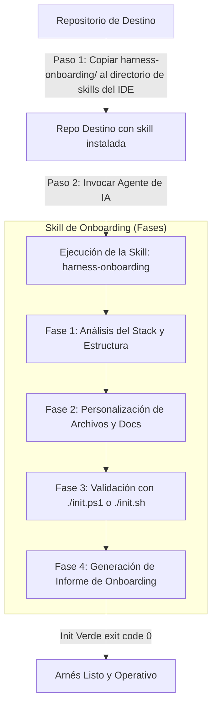

# Harness Template — Arnés de Agentes de IA 🚀

Este repositorio contiene la plantilla base y las herramientas necesarias para instalar y configurar un **arnés multi-agente** en cualquier proyecto. El arnés proporciona una estructura documental, roles de agente predefinidos, un ciclo de vida para las tareas (features) y validaciones automáticas, permitiendo que agentes de IA colaboren de forma ordenada, segura y trazable sin interferir con el stack tecnológico de tu código.

---

## 🗺️ Flujo de Trabajo del Onboarding

El siguiente diagrama ilustra el proceso completo desde la copia inicial del arnés hasta la activación del entorno operativo en el repositorio destino:



---

## 🛠️ ¿Cómo funciona la Skill `harness-onboarding`?

La skill `harness-onboarding` (definida en [.agents/skills/harness-onboarding/SKILL.md](file:///c:/Dev/GitWSL/Test/harness-template/.agents/skills/harness-onboarding/SKILL.md)) es un conjunto de instrucciones estructuradas para que un agente de IA realice la instalación y personalización del arnés de forma autónoma. El proceso se divide en **4 fases secuenciales**:

| Fase | Tarea del Agente | Archivos Afectados / Comandos |
| :--- | :--- | :--- |
| **Fase 1: Análisis** | Detecta el stack tecnológico, el lenguaje principal, la estructura de carpetas, y los comandos de test/lint. | Lectura de dependencias (`package.json`, `pyproject.toml`, `go.mod`, etc.) |
| **Fase 2: Edición** | Adapta los archivos genéricos del template con la información real descubierta en el análisis. | `feature_list.json`, `docs/architecture/overview.md`, `docs/engineering/verification/shared.md`, `docs/harness/*.md` |
| **Fase 3: Validación** | Ejecuta el script de inicialización y resuelve cualquier error (`[FAIL]`) hasta que esté en verde. | Ejecución de `./init.ps1` (Windows) o `./init.sh` (Linux/WSL) |
| **Fase 4: Informe** | Entrega un informe de cierre al usuario detallando el stack detectado, cambios realizados y tareas pendientes. | Mens## 🚀 Instalación y Uso

Para utilizar esta skill, sigue la guía general de instalación en el [README principal del repositorio](file:///C:/Dev/GitWSL/Gitlab/Nova/tpml-plataforma-harness-skill/README.md#%EF%B8%8F-c%C3%B3mo-utilizar-una-skill-en-un-proyecto).

Una vez copiada la carpeta `harness-onboarding/` en la ruta correspondiente a tu IDE:

1. Abre tu repositorio de destino en el IDE.
2. Escribe en el chat del agente:
   ```text
   Instala el harness para este proyecto
   ```
3. El agente de IA detectará de forma automática la skill `harness-onboarding` y ejecutará las 4 fases de configuración autónomamente.
o `SKILL.md` es un estándar abierto compatible con la mayoría de los agentes modernos.

---

## 📂 Estructura General del Arnés Desplegado

Una vez finalizado el onboarding, tu repositorio de destino lucirá con la siguiente jerarquía de archivos del arnés conviviendo con tu código fuente:

```text
raiz-del-proyecto/
├── .agents/
│   ├── agents/                     # Prompts de roles del sistema (architect, implementer, reviewer, gardener)
│   └── skills/
│       └── harness-onboarding/     # Archivos de la skill de instalación
├── docs/                           # Documentación técnica del proyecto
│   ├── README.md                   # Índice documental
│   ├── architecture/               # Diagramas, stack y decisiones técnicas
│   ├── engineering/                # Convenciones de código y comandos de verificación
│   └── harness/                    # Manual operativo y flujos del arnés
├── progress/                       # Seguimiento de tareas activas e histórico
│   ├── current.md                  # Feature actualmente bajo desarrollo
│   └── history.md                  # Historial append-only de features terminadas
├── scripts/                        # CLI en Python para la gestión de features
│   ├── open_feature.py             # Abrir feature (pending -> in_progress)
│   ├── close_feature.py            # Cerrar feature (in_progress -> done)
│   ├── block_feature.py            # Bloquear feature por impedimentos
│   ├── harness_state.py            # Ver estado del backlog y features
│   └── validate_harness.py         # Validador de consistencia y formato
├── AGENTS.md                       # Protocolo de entrada para el agente
├── CHECKPOINTS.md                  # Checkpoints de calidad de código y diseño
├── feature_list.json               # Backlog de features del proyecto
├── init.ps1                        # Script de inicialización (Windows)
└── init.sh                         # Script de inicialización (Linux/WSL)
```

---

## ⚠️ Reglas Importantes del Arnés

Para asegurar que el arnés funcione de manera efectiva y no se desvirtúe su propósito, ten en cuenta las siguientes directrices:

> [!IMPORTANT]
> **1. Una sola tarea activa a la vez:** Nunca trabajes en más de una feature en estado `in_progress` simultáneamente.
> 
> **2. Init verde obligatorio:** No se permite realizar fusiones de ramas (merges) ni cerrar una feature en `feature_list.json` si el comando `./init.ps1` o `./init.sh` devuelve algún error (`exit code` distinto de 0).
> 
> **3. Mantén los roles genéricos:** Los prompts en `.agents/agents/` son transversales y no deben modificarse con nombres o rutas específicas de un único proyecto.
> 
> **4. Sin features fantasma:** Todas las features añadidas a `feature_list.json` deben ser reales, realizables y coherentes con la hoja de ruta del proyecto.
